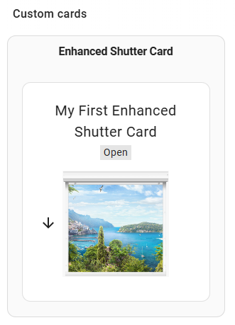
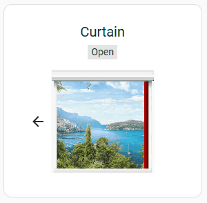

# Enhanced Shutter Card

[](https://github.com/custom-components/hacs) [](https://buymeacoffee.com/marcelhoogantink)
---

## Installation:

Use this button:

[](https://my.home-assistant.io/redirect/hacs_repository/?owner=marcelhoogantink&repository=enhanced-shutter-card&category=plugin)
...and download the card, or use HACS, search for `Enhanced Shutter Card`.
The resources will automatically be configured with the needed files.

When this all is done, you can find the card in Home Assistant in `custom cards` under the `By Card` tab in the list of available cards when building a Dashboard:



<small>*(When unfortunately both options above don't work, you need to add this repository as a Custom Repository.
See for installing Custom Repositories this [hacs-custom-repositories](https://www.hacs.xyz/docs/faq/custom_repositories/) page.
Enter repository-url: `https://github.com/marcelhoogantink/enhanced-shutter-card.git` and choose type: `Dashboard`.)</small>*


When you're done, you can...

Star <a href="https://github.com/marcelhoogantink/enhanced-shutter-card" target="_blank">  ⭐ <b>Enhanced Shutter Card</b> </a> on GitHub

 ... or ...

<a href="https://www.buymeacoffee.com/marcelhoogantink" target="_blank"></a>

Thank you !

---
### New in version v1.4.0-beta-1:

This a interim release for (hopefully) repairing all the problems and issues that this card had with variuos cover-types.
With this changes and new settings all different behavior should be possible to handle.
It is possible that your cover changes its hehavior with this release. As I do just have one type of cover, I cannot check type I do not have.
If your cover changed its behavior with this release, you need to play with the four settings below to get te wanted behavior.
When you do not get it done, please raise an issue for it on Github.

- #### Improved settings for open/close and percentage setting for controling device invert-settings:

  - ##### invert_percentage_cover (boolean)
    (from deprecated setting `invert_percentage`)
    Invert/alter the setting for percentage on device level.

  - ##### invert_open_close_cover (boolean)
    (new defeniton)
    Invert/alter the setting for open-close on device level.

  - ##### invert_percentage_ui (boolean)
    (new defeniton)
    Invert/alter the setting for percentage on user-interface level.

  - ##### invert_open_close_ui (boolean)
    (from deprecated setting `invert_open_close`)
    Invert/alter the setting for open-close on user-interface level.
    Often used for awnings.
    <br/>

  See for default and possible settings [in this table](#configuration).
  With these four options all differnent behavior the different coevr-types should be possible to handle

- #### Solved issues:

  - [#123](https://github.com/marcelhoogantink/enhanced-shutter-card/issues/123) Open_close And invert_percentage issue
  - [#125](https://github.com/marcelhoogantink/enhanced-shutter-card/issues/125) Invert Status does not update image

---
##### For previous release-changes go to [Previous-release changes](#previous)


---

## All functions of the Card

This card allows besides opening, closing or setting a shutter to the opening rate you want, also many options to design your shutter by combining the sizes and images you want.

Ths shutter can close in down-, left- of right-direction.

It is a follow-up of [Deejayfool/Shuttercard](https://github.com/Deejayfool/hass-shutter-card), a nice Card for Shutters.
I started with a simple change for the motion of the shutters, but soon it became a huge update.
Due to the inactivity of the Shutter Card, I decided to add this one as 'Enhanced Shutter Card' to HACS.

It supports all options of the original Card, but also graphical options like different backgrounds, windows an shutters.
Also the sizes of every shutter can be altered:


(_find below the yaml for this example._)

By default (`preset_shutter` = `roller-shutter`) the card has 3 colored windows and shutter images, ands two background views in the package for verical shutters:

| color | window-image    | shutter-slat image    | shutter-bottom-bar image | default |
| ----- | --------------- | --------------------- | ------------------------ | ------- |
| grey  | esc-window.png  | esc-shutter-slat.png  | esc-shutter-bottom.png   | yes     |
| brown | esc-window2.png | esc-shutter-slat2.png | esc-shutter-bottom2.png  | no      |
| green | esc-window3.png | esc-shutter-slat3.png | esc-shutter-bottom3.png  | no      |

For horizontal shutter (`preset_shutter` = `curtain`) there is one image:

| color | window-image | shutter-slat image | shutter-bottom-bar image | default |
| ----- | ------------ | ------------------ | ------------------------ | ------- |
| red   | [see above]  | esc-curtain.png    | [none]                   | yes     |

For awnings (`preset_shutter` = `awning`) there is one set of images:

| color     | window-image | shutter-slat image | shutter-bottom-bar image | default |
| --------- | ------------ | ------------------ | ------------------------ | ------- |
| red/white | [see above]  | esc-awning.png     | esc-awning-bottom.png    | yes     |

These are the avialable background views:

| view filename | default |
| ------------- | ------- |
| esc-view.png  | yes     |
| esc-view2.png | no      |

These images can be combined like in the example above. For (optinal) defintion of the location of the images, a setting 'image_map" does exits.
The default map-setting can be found in the Configuration-info below.
It is also possible to enter a full path in the imagename itself. When a '/' is found in the image-name, the image-name is considerd to include a full path.
And last but not least, the `view_image` and `shutter_slat_image`-settings also accept HTML-color definitions like `red`, `green`, `'#AAFFEE'` or `rgb(255,255,0)` in stead of an image-filename. (The `#` input needs quotes around it in YAML)

## Configuration {#configuration}

### General

| Name                         | Type          | Required | Default                                       | Description                                                                                                                                                                                                                                                                | Remarks                                  |
| ---------------------------- | ------------- | -------- | --------------------------------------------- | -------------------------------------------------------------------------------------------------------------------------------------------------------------------------------------------------------------------------------------------------------------------------- | ---------------------------------------- |
| type                         | string        | Yes      | -                                             | Must be "custom:enhanced-shutter-card"
| title                        | string        | no       | -                                             | Title of the card
| shutter_preset               | string        | no       | `roller-shutter`                              | Several preset-shutters-setting-groups, which creates a good start-setting for a specific type of cover. See the table below for possible definitions and the settings of them
| passive_mode                 | boolean       | no       | false                                         | Interface works normal, but no action is sent to the shutters. A lock-icon is shown after the shutter-name.
| image_map                    | string        | No       | /local/community/enhanced-shutter-card/images | map of the images.
| window_image                 | string        | No       | esc-window.png                                | image of the window shutter.
| view_image                   | string        | No       | esc-back-view.png                             | background-image through the window, or a HTML color.
| shutter_slat_image           | string        | No       | esc-shutter-slat.png                          | Image of one slat of the shutter.
| shutter_bottom_image         | string        | No       | esc-shutter-bottom.png                        | the bottom bar of the shutter.
| rotate_slat_image            | boolean       | No       | true                                          | defines whether the `shutter_slat_image` wil rotate with the closing_direction (`true`) or not (`false`)
| stretch_bottom_image         | boolean       | No       | true                                          | defines whether the `shutter_bottom_image` wil be stretched to the windows-size (`true`)  or not (`false`). (Only perpendicular to the `closing_direction`)
| base_height_px               | int           | No       | 150                                           | height of image in pixels.
| base_width_px                | int           | No       | 150                                           | witdh of image in pixels.
| resize_height_pct            | int           | No       | 100                                           | resize of the base height in percent. (limited between 20% and 500%)
| resize_width_pct             | int           | No       | 100                                           | resize of the base width in percent. (limited between 20% and 500%)
| top_offset_pct               | int           | No       | 0                                             | space between top image/window and top shutter.
| bottom_offset_pct            | int           | No       | 0                                             | space between bottom image/window and bottom shutter.
| closing_direction            | string        | No       | `down`                                        | Set the closing direction: `down`, `left` or `right`.
| buttons_position             | string        | No       | `left`                                        | Set buttons on `left`, `right`, `top` or `bottom` of the shutter. For automatic placement on Landscape or Portrait-format of the visible Dashboard, you can also use the `auto-top-left` (or `auto`), `auto-top-right`, `auto-bottom-left` or `auto-bottom-right` options.
| scale_texts                  | boolean/float | No       | false                                         | Scale the texts according to the window-size (`true`) or scale it with a factor (`0.5` - `2.0`)
| scale_buttons                | boolean/float | No       | false                                         | Scale the buttons when the windows-image gets smaller then 150px in the direction of the button-placement (`true`), or scale it with a factor (`0.5` - `2.0`).
| scale_icons                  | boolean/float | No       | true                                          | Scale the icon for battery and signal icons windows-image gets smaller then 150px in the horizonal direction (`true`), or scale it with a factor (`0.5` - `2.0`).
| name_position                | string        | No       | `top`                                         | Set title/name shutter on `top` or on `bottom` of the shutter image.
| name_disabled                | boolean       | No       | false                                         | hide title/name of shutter
| opening_position             | string        | No       | _name_position_                               | set position info of shutter on `top` or `bottom` of the shutter image.
| opening_disabled             | boolean       | No       | false                                         | hide position info of shutter
| inline_header                | boolean       | No       | false                                         | place the shutter-header (name and position) in one line.
| invert_percentage            | boolean       | No       | `false`                                       | Set it to `true` if your shutter is 100% when it is closed, and 0% when it is opened                                                                                                                                                                                       | deprecated as of 1.4.0, use `invert_percentage_cover` |
| invert_percentage_ui         | boolean       | No       | `false`                                       | Inverts the percentage on UI-level when set to `true`. Will not change the cover behavior.                                                                                                                                                                                 |
| invert_percentage_cover      | boolean       | No       | `false`                                       | Inverts the precentage on device-level when set to `true`. Possibly changes to cover behavior.
| invert_open_close            | boolean       | No       | `false`                                       | Set it to `true` if your want to invert the `open` and `close` buttons. (for awnings)                                                                                                                                                                                      | deprecated as of 1.4.0, use `invert_open_close_ui` |
| invert_open_close_ui         | boolean       | No       | `false`                                       | Inverts the open-close texts on UI-level when set to `true`. Will not change the cover behavior.
| invert_open_close_cover      | boolean       | No       | `false`                                       | Inverts the opec-close commands on device-level when set to `true`. Possibly changes to cover behavior.                                                                                                                                                                    |
| show_tilt                    | boolean       | No       | `true`                                        | Show the `tilt` options and buttons, only active when the shutter supports `tilt`                                                                                                                                                                                          |
| partial_close_percentage     | int           | No       | `0`                                           | Set it to a percentage (0-100) if you want to be able to quickly go to this "partially closed" state using a button.                                                                                                                                                       |
| offset_closed_percentage     | int           | No       | `0`                                           | Set it to a percentage (0-100) of travel that will still be considered a "closed" state in the visualization.                                                                                                                                                              |
| always_percentage            | boolean       | No       | `false`                                       | If set to `true`, the end states (opened/closed) will be also as numbers (0 / 100 % ) instead of a text                                                                                                                                                                    |
| disable_end_buttons          | boolean       | No       | `false`                                       | If set to `true`, the end states (opened/closed) will also deactivate the buttons for that direction (i.e. the "up" button                                                                                                                                                 |
| disable_standard_buttons     | boolean       | No       | false                                         | Show or hide the default up, down and stop buttons                                                                                                                                                                                                                         |
| disable_partial_open_buttons | boolean       | No       | true                                          | Show or hide the partail open buttons.                                                                                                                                                                                                                                     |
| button_up_hide_states        | string list   | No       | empty list                                    | Entered state strings (`opening`, `open`, `closed`, `closing` or `partial_open`) added will hide the `up` button when the cover is in any of the listed states. This can be combined with other `*_hide_states` options.                                                   |
| button_stop_hide_states      | string list   | No       | empty list                                    | Entered state strings (`opening`, `open`, `closed`, `closing` or `partial_open`) added will hide the `stop` button when the cover is in any of the listed states. This can be combined with other `*_hide_states` options.                                                 |
| button_down_hide_states      | string list   | No       | empty list                                    | Entered state strings (`opening`, `open`, `closed`, `closing` or `partial_open`) added will hide the `down` button when the cover is in any of the listed states. This can be combined with other `*_hide_states` options.                                                 |

### Entities

| Name                         | Type        | Required | Default                                  | Description                                                                                 | remarks                                      |
| ---------------------------- | ----------- | -------- | ---------------------------------------- | ------------------------------------------------------------------------------------------- | -------------------------------------------- |
| entity                       | string      | Yes      | -                                        | The shutter entity ID                                                                       |
| name                         | string      | No       | _Friendly name of the entity_            | Name to display for the shutter                                                             |
| battery_entity               | string      | No       | `null`                                   | EntityId of the sensor represenating the battery-level of the shutter (as a number)         |
| signal_entity                | string      | No       | `null`                                   | EntityId of the sensor represenating the Wireless signal-level of the shutter (as a number) |
| shutter_preset               | string      | No       | global item setting, see under _General_ | see under _General_                                                                         |
| passive_mode                 | boolean     | No       | global item setting, see under _General_ | see under _General_                                                                         |
| image_map                    | string      | No       | global item setting, see under _General_ | see under _General_                                                                         |
| window_image                 | string      | No       | global item setting, see under _General_ | see under _General_                                                                         |
| view_image                   | string      | No       | global item setting, see under _General_ | see under _General_                                                                         |
| shutter_slat_image           | string      | No       | global item setting, see under _General_ | see under _General_                                                                         |
| shutter_bottom_image         | string      | No       | global item setting, see under _General_ | see under _General_                                                                         |
| rotate_slat_image            | boolean     | No       | global item setting, see under _General_ | see under _General_                                                                         |
| stretch_bottom_image         | boolean     | No       | global item setting, see under _General_ | see under _General_                                                                         |
| base_height_px               | int         | No       | global item setting, see under _General_ | see under _General_                                                                         |
| base_width_px                | int         | No       | global item setting, see under _General_ | see under _General_                                                                         |
| resize_height_pct            | int         | No       | global item setting, see under _General_ | see under _General_                                                                         |
| resize_width_pct             | int         | No       | global item setting, see under _General_ | see under _General_                                                                         |
| top_offset_pct               | int         | No       | global item setting, see under _General_ | see under _General_                                                                         |
| bottom_offset_pct            | int         | No       | global item setting, see under _General_ | see under _General_                                                                         |
| closing_direction            | string      | No       | global item setting, see under _General_ | see under _General_                                                                         |
| buttons_position             | string      | No       | global item setting, see under _General_ | see under _General_                                                                         |
| scale_buttons                | boolean     | No       | global item setting, see under _General_ | see under _General_                                                                         |
| scale_icons                  | boolean     | No       | global item setting, see under _General_ | see under _General_                                                                         |
| name_position                | string      | No       | global item setting, see under _General_ | see under _General_                                                                         |
| name_disabled                | boolean     | No       | global item setting, see under _General_ | see under _General_                                                                         |
| opening_position             | string      | No       | global item setting, see under _General_ | see under _General_                                                                         |
| opening_disabled             | boolean     | No       | global item setting, see under _General_ | see under _General_                                                                         |
| inline_header                | boolean     | No       | global item setting, see under _General_ | see under _General_                                                                         |
| invert_percentage            | boolean     | No       | global item setting, see under _General_ | see under _General_                                                                         | deprecated as of 1.4.0
| invert_percentage_ui         | boolean     | No       | global item setting, see under _General_ | see under _General_                                                                         |
| invert_percentage_cover      | boolean     | No       | global item setting, see under _General_ | see under _General_                                                                         |
| invert_open_close            | boolean     | No       | global item setting, see under _General_ | see under _General_                                                                         | deprecated as of 1.4.0
| invert_open_close ui         | boolean     | No       | global item setting, see under _General_ | see under _General_                                                                         |
| invert_open_close cover      | boolean     | No       | global item setting, see under _General_ | see under _General_                                                                         |
| show_tilt                    | boolean     | No       | global item setting, see under _General_ | see under _General_                                                                         |
| partial_close_percentage     | int         | No       | global item setting, see under _General_ | see under _General_                                                                         |
| offset_closed_percentage     | int         | No       | global item setting, see under _General_ | see under _General_                                                                         |
| always_percentage            | boolean     | No       | global item setting, see under _General_ | see under _General_                                                                         |
| disable_end_buttons          | boolean     | No       | global item setting, see under _General_ | see under _General_                                                                         |
| disable_standard_buttons     | boolean     | No       | global item setting, see under _General_ | see under _General_                                                                         |
| disable_partial_open_buttons | boolean     | No       | global item setting, see under _General_ | see under _General_                                                                         |
| button_up_hide_states        | string list | No       | global item setting, see under _General_ | see under _General_                                                                         |
| button_stop_hide_states      | string list | No       | global item setting, see under _General_ | see under _General_                                                                         |
| button_down_hide_states      | string list | No       | global item setting, see under _General_ | see under _General_                                                                         |

_Remark : you can also just give the entity ID (without to specify `entity:`) if you don't need to specify the other configurations._

### Shutter Presets
The following `preset_shutter` settings are available:

| **Preset Name** | **Setting**                    | **Value**                 |
| ---------------- | ----------------------------- | ------------------------- |
| **roller-shutter** | `rotate_slat_image`         | `true`                    |
| **awning**         | `invert_open_close_ui`      | `true`                    |
|                    | `shutter_slat_image`        | `esc-awning.png`          |
|                    | `shutter_slat_bottom_image` | `esc-awning-bottom.png`   |
|                    | `bottom_offset_pct`         | `50`                      |
|                    | `stretch_bottom_image`      | `false`                   |
|                    | `closing_direction`         | `down`                    |
| **curtain**        | `closing_direction`         | `right`                   |
|                    | `shutter_slat_image`        | `esc-curtain.png`         |
|                    | `shutter_slat_bottom_image` | `''`                      |
|                    | `rotate_slat_image`         | `false`                   |
|                    | `closing_direction`         | `down`                    |
| **shade**          | `shutter_slat_image`        | `'#00000080'`           |


### Sample

The samples below are the settings of the example image above.

```yaml
type: custom:enhanced-shutter-card
title: Shutter Samples
name_position: top
entities:
  - entity: cover.demo1
    name: Variable Hidden Standard Buttons
    view_image: esc-view2.png
    passive_mode: false
    name_position: top
    base_height_px: 180
    button_up_hide_states:
      - open
      - opening
      - closing
    button_down_hide_states:
      - closed
      - opening
      - closing
    button_stop_hide_states:
      - open
      - closed
      - partial_open
  - entity: cover.demo2
    name: Passive Mode
    passive_mode: true
    partial_close_percentage: 85
    name_position: top
    base_height_px: 100
    base_width_px: 160
    shutter_slat_image: esc-shutter-slat2.png
    window_image: esc-window3.png
    disable_partial_open_buttons: true
    always_percentage: true
    invert_percentage_ui: false
    invert_percentage_cover: false
  - entity: cover.demo3
    name: Include Partial Open Buttons
    disable_end_buttons: true
    window_image: esc-window2.png
    resize_width_pct: 70
    name_position: top
    disable_partial_open_buttons: false
```

---
## Previous release-changes:{#previous}
---
### New in version v1.3.1:

- #### Handling not-found images
  When an image entered in the Card is not found, the default image for the image-type wil be used, and a warning is sent to the console.
- #### Wrong open/close texts in the position header for awnings.
  The wrong open/closed/opening/closing texts for awnings are corrected.
- #### Inactive Buttons improved.
  When is shutter is (temporary) unavailable the buttons are now still active, so it may trigger the cover to activate.
- #### battery percentage icon
  If the battery percentage > 100%, the icon will still be displayed.

- #### Solved issues:
  - [#115](https://github.com/marcelhoogantink/enhanced-shutter-card/issues/115) shutter-card disappeared
  - [#117](https://github.com/marcelhoogantink/enhanced-shutter-card/issues/117) Buttons inactive after update
  - [#118](https://github.com/marcelhoogantink/enhanced-shutter-card/issues/118) Awning problem
  - [#119](https://github.com/marcelhoogantink/enhanced-shutter-card/issues/119) Fix issue with battery percentage over 100%

---
### New in version v1.3.0:

- #### [BREAKING CHANGES]   <small>*(sorry!!)*</small>
  - ##### Automatic curtain image setting stops
    In version 1.2.3, the card automaticly chooses for `esc-curtain.png` for displaying a curtain instead of a cover, when setting `closing-direction` to`left` or `right`. This stops in version 1.3.0 due to the new preset-option `shutter_preset`.
    Solving this breaking-change starts with adding the setting `shutter_preset = curtain` in your Card-YAML-code.
    For more inforamtion on this, see this new option below and in the Configuration chapter
  - ##### Changes in automatic card rescale and fitting
    The automatic scaling of the card was not very stable and created unpredictable results sometimes. So this is changed.
    Because of this change cards, might have some size changes, and there is a risc that not all cards still fit in your dashboard unchanged.

- #### New option: [shutter_preset]
  This version introduces the option `shutter_preset`. Setting this to a type, predefines the Card to display a correct setting of that type.
  Current types are: `shutter`, `shade`, `curtain` and `awning`.
  The pre-settings of these shutter_presets can be overridden by or supplemented with other settings.
  See also the Configuration chapter.
- #### Image definitions do now accept colors and colorcodes
  All images settings (except `window_image`) now accept colors and colorcodes besides image-filenames, like `red` or `'#aaf1bb'` like `view_image` already did.
- #### New option: [invert_open_close].
  For awnings, a new options is introduced: `invert_open_close` (true/false)  for making the card more logic for this kind of covering. Use `true` for awnings.
  (This setting is also activated by using a new option `shutter_preset`: `shutter_preset = awning`)
- #### extending `scale_buttons` and `scale_icons`
  Extending `scale_buttons` and `scale_iconswith` posibiility to define a scalefactor besides `false` or `true`. Like `scale_buttons: 1.5`
- #### new option `scale_texts`
  new option `scale_texts` for scaling tests, options are: `true`, `false` or a factor like `1.5` or `0.7`
- #### new option `rotate_slat_image`
  new option `rotate_slat_image` defines whether the `shutter_slat_image` rotates with the set `closing_direction` (`true`) or stays fixed (`false`)
- #### new option `stretch_bottom_image`
  new option `stretch_bottom_image` defines whether the `shutter_bottom_image` wil be stretched to the shutter-width (`true`) or will be repeated using fixed image-size (`false`).
  this streching is only perpendicular to the closing direction.
- #### Solved issues:
  - [#52](https://github.com/marcelhoogantink/enhanced-shutter-card/issues/52) [Bug] Icons not scaling, too small to see
  - [#60](https://github.com/marcelhoogantink/enhanced-shutter-card/issues/60) Title font size
  - [#88](https://github.com/marcelhoogantink/enhanced-shutter-card/issues/88) Question only
  - [#91](https://github.com/marcelhoogantink/enhanced-shutter-card/issues/91) Add transparent white Horizontal moving shutters
  - [#95](https://github.com/marcelhoogantink/enhanced-shutter-card/issues/95) [FEATURE REQUEST] Invert arrow functionality
  - [#97](https://github.com/marcelhoogantink/enhanced-shutter-card/issues/97) Shutter image horizontal shrink when command buttons are on the left or on the right
  - [#98](https://github.com/marcelhoogantink/enhanced-shutter-card/issues/98) Invert open/close
  - [#99](https://github.com/marcelhoogantink/enhanced-shutter-card/issues/99) [Code Share] Really difficult way to get this card to have a control page
  - [#101](https://github.com/marcelhoogantink/enhanced-shutter-card/issues/101) Awning Buttons & Transparency
  - [#103](https://github.com/marcelhoogantink/enhanced-shutter-card/issues/103) [Feature Request] Add shade support #103
  - [#104](https://github.com/marcelhoogantink/enhanced-shutter-card/issues/104) Card as “custom_fields” in a button-card.
  - [#108](https://github.com/marcelhoogantink/enhanced-shutter-card/issues/108) How disable "partially close" button
  - [#109](https://github.com/marcelhoogantink/enhanced-shutter-card/issues/109) Dashboard not updating properly. Intermittent incomplete dashboards
  - [#111](https://github.com/marcelhoogantink/enhanced-shutter-card/issues/111) invert_percentage: true causes appearance of "partial close" button
  - [#113](https://github.com/marcelhoogantink/enhanced-shutter-card/issues/113) View layout with error: Unknown keyword: [view_layout], check your input!
---
### New in version v1.2.3:

- #### Enhanced Shutter Card is now part of the default HACS-repositories  :tada: :tada:

- #### Solved ussues:
  - [#72](https://github.com/marcelhoogantink/enhanced-shutter-card/issues/72) Unable to open/close the shutter in scroll view on mobile.
  - [#68](https://github.com/marcelhoogantink/enhanced-shutter-card/issues/72) Background colors not working (already solved in v1.2.1)

---
### New in version v1.2.0:

- #### Card funtionality is now controled by the `supported_features` attribute of the shutter.
  The Card now reads the supported-features attributesof the cover, and acts on it.
  Therefore the `can_tilt`option is changed into `show_tilt`
- #### Horizontal moving shutters (left to right, right to left)
  Horizontal moving shutters are now possible. Add `closing_direction` to your settings, and give it the value `left`, `right` or `down`.
  Setting `down` is default.

  

  For horizontal moving shutters (curtains), a new image is added: `esc_curtain.png`
- #### Warnings (unknown/deprected/removed items) while editing the shutters in YAML.
  To help you with defining your settings, unknown/deprecated/removed messaged are shown when defing your card in YAML.
- #### can_tilt is deprecated , use show_tilt
  `can_tilt` option is replace by `show_tilt`, due to the Card is now reading and acting on `supported-features`-attribute of the shutter.
- #### calculated grid-space for the card (in rows and colums) is displayed while editing the card in yaml.
  For more control on the size of the Card, the needed Gridsize (rows, columsn) are shown while editing the Card in Yaml.
  For more information on the Gridsize, see: https://developers.home-assistant.io/docs/frontend/custom-ui/custom-card/#sizing-in-sections-view.
- #### option `title_position`is removed.
  after some time `deprecated` this setting is now `removed`,use `name_position`.
- #### solved issues:
  - [#59](https://github.com/marcelhoogantink/enhanced-shutter-card/issues/59) Size and Toggle.
  - [#57](https://github.com/marcelhoogantink/enhanced-shutter-card/issues/57) Stop-button not showing up.
  - [#56](https://github.com/marcelhoogantink/enhanced-shutter-card/issues/56) Current position of shutter not updated in card with MQTT cover
  - [#54](https://github.com/marcelhoogantink/enhanced-shutter-card/issues/54) Movement arrow display bug when shutter is in movement
  - [#49](https://github.com/marcelhoogantink/enhanced-shutter-card/issues/49) Full path option for images
  - [#48](https://github.com/marcelhoogantink/enhanced-shutter-card/issues/48) 6 buttons on right works inversed and ‘invert_percentage’ true or false has no effect as sliding shutter
  - [#44](https://github.com/marcelhoogantink/enhanced-shutter-card/issues/44) Vertical space larger than required
  - [#43](https://github.com/marcelhoogantink/enhanced-shutter-card/issues/43) rotate shutter 90°

---

### New in version v1.1.4:

- #### New: Battery and Signal level display

  New settings `battery_entity` and `signal_entity` for displaying battery and signal icon with level-information.
  New settings `scale_icons` for activating scaling of the icons when the image is made smaller.

- #### Card works now 100% local.

  The card inludes now the lit-libary, no internet-connection needed after downloading.

- #### Solved [Error#46 ](https://github.com/marcelhoogantink/enhanced-shutter-card/issues/46) (Custom element does not exist) solved.

  This error is found and removed.

- #### Improved sizing of the Card

  New settings `battery_entity` and `signal_entity` for displaying battery and signal icon with level-information.
  New settings `scale_icons` for activating scaling of the icons when the image is made smaller.
  

- #### Solved [Error#46 ](https://github.com/marcelhoogantink/enhanced-shutter-card/issues/46) (Custom element does not exist)
  This bug is found and removed.

- #### Improved sizing of the Card
  The sizing of the card is further improved. (This can result in little differences in size with previous versions)

### New in version v1.1.3:

- #### New automatic placement of the buttons
  New automatic placement of the buttons according to Landscape or Portrait format of the visible part of the dashboard. Using the new settings `auto-top-left` (or `auto`), `auto-top-right`, `auto-bottom-left` or `auto-bottom-right` for the optional option `buttons_position`, the card wil change the button positions to top or botton on Portrait and Left or Right in Landscape, automaticly.
- #### inline_header
  New setting (`true` of `false`). When set to `true`, the card wil place the Name and Position information in one line, as long as possible. In this mode, only the `opening_position` option will be used for the `bottom`/`top` placement of the full shutter header, the `opening_position`wil be discarded.
- #### scale_buttons
  New setting (`true` of `false`). When set to `true` the buttons will be rescaled (smaller) when the windows-image is getting smaller then 150px. The width is taken into account when the resulting button_position is `left` or `right`, the heieght is used when `buttons_position`is `top` or `bottom`. This will work also with the new `auto*` options.
- #### further improvement of responsiveness.
  The responsiveness of the card is further improved.
