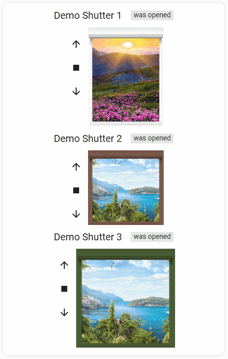

# Enhanced Shutter Card

[](https://github.com/custom-components/hacs)
[](https://buymeacoffee.com/tijq3xcipj)


This card allows besides opening, closing or setting a shutter to the opening rate you want, also many options to design your shutter by combining sizes and images you want.

It is a follow-up of [Deejayfool/Shuttercard](https://github.com/Deejayfool/hass-shutter-card), a nice Card for Shutters.
I started with a simple change for the motion of the shutters, but soon it became a great update.
Due to the inactivity of this Shutter Card, I decided to add this one as 'Enhanced Shutter Card' to HACS.

It supports all options of the original Card, but also graphical options like different backrounds, windows an shutters.
Also the sizes of every shutter can be altered:


Find below the yaml for this example.

By default the card has 3 colored windows and shutter images, ands two background view.

| color | window-image | shutter-slat image | shutter-bottom-bar image | default
| -| - | - | - | -
| grey | esc-window.png   | esc-shutter-slat.png  | esc-shutter-bottom.png | yes
| brown | esc-window2.png | esc-shutter-slat2.png | esc-shutter-bottom2.png | no
| green | esc-window3.png | esc-shutter-slat3.png | esc-shutter-bottom3.png | no

These are the avialable background views:

| view filename | default
|-|-
| esc-view.png | yes
| esc-view2.png | no

These files can be combined like in the example above. For the location of the images a setting 'image_map" does exits.
The default map-setting can be found in the Configuration-info below.
It is also possible to enter a full path in the imagename itself. When a '/' is found in the image-name, the image-name is condiderd to include a full path.

## Configuration

### General

| Name | Type | Required | Default | Description
| ---- | ---- | -------- | ------- | -----------
| type | string | True | - | Must be "custom:shutter-card"
| title | string | False | - | Title of the card
| image_map | string | No | /local/community/enhanced-shutter-card/images | map of the images
| window_image | string | No | esc-window.png | image of the window/shutter
| view_image | string | No | esc-back-view.png | background-image trough the window.
| shutter_slat_image | string | No | esc-shutter-slat.png | Image of one slat of the shutter.
| shutter_bottom_bar_image | string | No | esc-shutter-bottom.png | the bottom bar of the shutter.
| base_height_px | int | No | _height of image_ | height of image in pixels
| base_width_px | int | No | _width of image_ | witdh of image in pixels
| resize_height_pct | int | No | 100 | rezise of the base height in percent
| resise_width_pct | int | No | 100 | rezise of the base width in percent
| buttons_position | string | No | `left` | Set buttons on `left`, `right`, `top` or `bottom` of the shutter
| title_position | string | No | `top` | Set title on `top` or on `bottom` of the shutter
| invert_percentage | boolean | No | `false` | Set it to `true` if your shutter is 100% when it is closed, and 0% when it is opened
| can_tilt | boolean | No | `false` | Set it to `true` if your shutters support tilting.
| partial_close_percentage | int | No | `0` | Set it to a percentage (0-100) if you want to be able to quickly go to this "partially closed" state using a button.
| offset_closed_percentage | int | No | `0` | Set it to a percentage (0-100) of travel that will still be considered a "closed" state in the visualization.
| always_percentage | boolean | No | `false` | If set to `true`, the end states (opened/closed) will be also as numbers (0 / 100 % ) instead of a text
| shutter_width_px? | int | No | `153` | Set shutter visualization width in px. You can make it thicker or narrower to fit your layout.
| disable_end_buttons | boolean | No | `false` | If set to `true`, the end states (opened/closed) will also deactivate the buttons for that direction (i.e. the "up" button
### Entities

| Name | Type | Required | Default | Description |
| ---- | ---- | -------- | ------- | ----------- |
| entity | string | Yes | - | The shutter entity ID
| name | string | No | _Friendly name of the entity_ | Name to display for the shutter
| image_map | string | No | global item setting, see under _General_ | see under _General_
| window_image | string | No | global item setting, see under _General_ | see under _General_
| view_image | string | No | global item setting, see under _General_ | see under _General_
| shutter_slat_image | string | No | global item setting, see under _General_ | see under _General_
| shutter_bottom_bar_image | string | No |global item setting, see under _General_ | see under _General_
| base_height_px | int | No | global item setting, see under _General_ | see under _General_
| base_width_px | int | No | global item setting, see under _General_ | see under _General_
| resize_height_pct | int | No | global item setting, see under _General_ | see under _General_
| resise_width_pct | int | No | global item setting, see under _General_ | see under _General_
| buttons_position | string | No | global item setting, see under _General_ | see under _General_
| title_position | string | No | global item setting, see under _General_ | see under _General_
| invert_percentage | boolean | No | global item setting, see under _General_ | see under _General_
| can_tilt | boolean | No | global item setting, see under _General_ | see under _General_
| partial_close_percentage | int | No | global item setting, see under _General_ | see under _General_
| offset_closed_percentage | int | No | global item setting, see under _General_ | see under _General_
| always_percentage | boolean | No | global item setting, see under _General_ | see under _General_
| shutter_width_px ?| int | No | global item setting, see under _General_ | see under _General_
| disable_end_buttons | boolean | No | global item setting, see under _General_ | see under _General_

_Remark : you can also just give the entity ID (without to specify `entity:`) if you don't need to specify the other configurations._

### Sample

The sample below are the settings of the image above.
```yaml
type: custom:enhanced-shutter-card
entities:
  - entity: cover.shutter1
    view_image: esc-back-view2.png
    name: Shutter 1
    slide_image: esc-shutter-slat2.png
    base_height_px: 200
  - entity: cover.shutter2
    name: Shutter 2
    window_image: esc-window2.png
    slide_image: esc-shutter-slat3.png
    slide_bottom_image: esc-shutter-bottom3.png
  - entity: cover.rl_computerkame3
    name: cover.shutter3
    base_height_px: 200
    base_width_px: 200
    resize_height_pct: 75
    window_image: esc-window3.png
    slide_bottom_image: esc-shutter-bottom2.png
```

## Install

If you use HACS, the resources will automatically be configured with the needed file.

If you don't use HACS, you can download js file from [latest releases](https://github.com/marcelhoogantink/enhanced-hass-shutter-card/releases). Drop it then in `www` folder in your `config` directory. Next add the following entry in lovelace configuration (`config/www` points to `local`):

```yaml
resources:
  - url: /local/hass-shutter-card.js
    type: module
```
