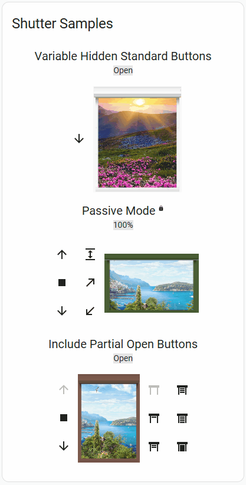

# Enhanced Shutter Card

[](https://github.com/custom-components/hacs)
[](https://buymeacoffee.com/tijq3xcipj)

### New in version v1.1.4:

* #### New: Battery and signal level display
New settings `battery_entity` and `signal_entity` for displaying battery and signal icons with level-information.
New settings `scale_icons` for activating scaling of the icons when the window-image-size is made smaller.


* #### Card works now 100% local.
The card inludes now the lit-library, no internet-connection needed after downloading.

* #### Solved [Error#46 ](https://github.com/marcelhoogantink/enhanced-shutter-card/issues/46) (Custom element does not exist) 
This bug is found and removed.

* #### Improved sizing of the Card

The sizing of the card is further improved. (This can result in little differences in size with previous versions)


### New in version v1.1.3:

* #### New automatic placement of the buttons
New automatic placement of the buttons according to Landscape or Portrait format of the visible part of the dashboard. Using the new settings `auto-top-left` (or `auto`), `auto-top-right`, `auto-bottom-left` or `auto-bottom-right` for the optional option `buttons_position`, the card wil change the button positions to top or botton on Portrait and Left or Right in Landscape, automaticly.
* #### inline_header
New setting (`true` of `false`). When set to `true`, the card wil place the Name and Position information in one line, as long as possible. In this mode, only the `opening_position` option will be used for the `bottom`/`top` placement of the full shutter header, the `opening_position`wil be discarded.
* #### scale_buttons
New setting (`true` of `false`). When set to `true` the buttons will be rescaled (smaller) when the windows-image is getting smaller then 150px. The width is taken into account when the resulting button_position is `left` or `right`, the heieght is used when `buttons_position`is `top` or `bottom`. This will work also with the new `auto*` options.
* #### further improvement of responsiveness.
The responsiveness of the card is further improved.


## Functions of the Card

This card allows besides opening, closing or setting a shutter to the opening rate you want, also many options to design your shutter by combining the sizes and images you want.

It is a follow-up of [Deejayfool/Shuttercard](https://github.com/Deejayfool/hass-shutter-card), a nice Card for Shutters.
I started with a simple change for the motion of the shutters, but soon it became a huge update.
Due to the inactivity of the Shutter Card, I decided to add this one as 'Enhanced Shutter Card' to HACS.

It supports all options of the original Card, but also graphical options like different backgrounds, windows an shutters.
Also the sizes of every shutter can be altered:



(_find below the yaml for this example._)

By default the card has 3 colored windows and shutter images, ands two background views in the package:

| color | window-image | shutter-slat image | shutter-bottom-bar image | default
| -| - | - | - | -
| grey | esc-window.png   | esc-shutter-slat.png  | esc-shutter-bottom.png | yes
| brown | esc-window2.png | esc-shutter-slat2.png | esc-shutter-bottom2.png | no
| green | esc-window3.png | esc-shutter-slat3.png | esc-shutter-bottom3.png | no

These are the avialable background views:

| view filename | default
|-|-
| esc-view.png | yes
| esc-view2.png | no

These images can be combined like in the example above. For (optinal) defintion of the location of the images, a setting 'image_map" does exits.
The default map-setting can be found in the Configuration-info below.
It is also possible to enter a full path in the imagename itself. When a '/' is found in the image-name, the image-name is considerd to include a full path.
And last but not least, the `view_image` -setting also accepts HTML-color definitions like `red`, `green`, `#AAFFEE` or `rgb(255,255,0)` in stead of an image-filename. (The `#` input needs quotes around it in YAML)

## Configuration

### General

| Name                         | Type        | Required | Default                                       | Description | Remarks |
|------------------------------|-------------| - |-----------------------------------------------| - | - |
| type                         | string      | True | -                                             | Must be "custom:enhanced-shutter-card"
| title                        | string      | False | -                                             | Title of the card
| passive_mode                 | boolean     | no | false                                         | Interface works normal, but no action is sent to the shutters. A lock-icon is shown after the shutter-name.|
| image_map                    | string      | No | /local/community/enhanced-shutter-card/images | map of the images
| window_image                 | string      | No | esc-window.png                                | image of the window/shutter
| view_image                   | string      | No | esc-back-view.png                             | background-image through the window, or a HTML color.
| shutter_slat_image           | string      | No | esc-shutter-slat.png                          | Image of one slat of the shutter.
| shutter_bottom_image         | string      | No | esc-shutter-bottom.png                        | the bottom bar of the shutter.
| shutter_bottom_height_px     | int         | No | 7                                             | Height of the image `shutter_bottom_image` in pixels.
| base_height_px               | int         | No | 150                                           | height of image in pixels
| base_width_px                | int         | No | 150                                           | witdh of image in pixels
| resize_height_pct            | int         | No | 100                                           | rezise of the base height in percent
| resize_width_pct             | int         | No | 100                                           | rezise of the base width in percent
| top_offset_pct               | int         | No | 10.5                                          | space between top image/window and top shutter
| bottom_offset_pct            | int         | No | 3.9                                           | space between bottom image/window and bottom shutter
| left_offset_pct              | int         | No | 5.2                                           | space between left image/window and left side of shutter
| right_offset_pct             | int         | No | 5.2                                           | space between right image/window and right side shutter
| buttons_position             | string      | No | `left`                                        | Set buttons on `left`, `right`, `top` or `bottom` of the shutter. For automatic placement  on Landscape or Portrait-format of the visible Dashboard, you can also use the `auto-top-left` (or `auto`), `auto-top-right`, `auto-bottom-left` or `auto-bottom-right` options.
| scale_buttons                | boolean     | No | false                                         | Scale the buttons when the windows-image gets smaller then 150px in the direction of the button-placement.
| scale_icons                  | boolean     | No | true                                          | Scale the icon for battery and signal icons windows-image gets smaller then 150px in the horizonal direction.
| title_position               | string      | No | `top`                                         | Set title on `top` or on `bottom` of the shutter | deprecated, use `name_position`|
| name_position                | string      | No | `top`                                         | Set title/name shutter on `top` or on `bottom` of the shutter image.|
| name_disabled                | boolean     | No | false                                         | hide title/name of shutter |
| opening_position             | string      | No | _name_position_                               | set position info of shutter on `top` or `bottom` of the shutter image.|
| opening_disabled             | boolean     | No | false                                         | hide position info of shutter |
| inline_header                | boolean     | No | false                                         | place the shutter-header (name and position) in one line.
| invert_percentage            | boolean     | No | `false`                                       | Set it to `true` if your shutter is 100% when it is closed, and 0% when it is opened
| can_tilt                     | boolean     | No | `false`                                       | Set it to `true` if your shutters support tilting.
| partial_close_percentage     | int         | No | `0`                                           | Set it to a percentage (0-100) if you want to be able to quickly go to this "partially closed" state using a button.
| offset_closed_percentage     | int         | No | `0`                                           | Set it to a percentage (0-100) of travel that will still be considered a "closed" state in the visualization.
| always_percentage            | boolean     | No | `false`                                       | If set to `true`, the end states (opened/closed) will be also as numbers (0 / 100 % ) instead of a text
| disable_end_buttons          | boolean     | No | `false`                                       | If set to `true`, the end states (opened/closed) will also deactivate the buttons for that direction (i.e. the "up" button
| disable_standard_buttons     | boolean     | No | false                                         | Show or hide the default up, down and stop buttons |
| disable_partial_open_buttons | boolean     | No | true                                          | Show or hide the partail open buttons. |
| button_up_hide_states        | string list | False | empty list                                    | Entered state strings (`opening`, `open`, `closed`, `closing` or `partial_open`) added will hide the `up` button when the cover is in any of the listed states.  This can be combined with other `*_hide_states` options. |
| button_stop_hide_states      | string list | False | empty list                                    | Entered state strings (`opening`, `open`, `closed`, `closing` or `partial_open`) added will hide the `stop` button when the cover is in any of the listed states.  This can be combined with other `*_hide_states` options. |
| button_down_hide_states      | string list | False | empty list                                    | Entered state strings (`opening`, `open`, `closed`, `closing` or `partial_open`) added will hide the `down` button when the cover is in any of the listed states.  This can be combined with other `*_hide_states` options. |

### Entities

| Name | Type | Required | Default | Description | remarks |
| - | - | - | - | - | - |
| entity | string | Yes | - | The shutter entity ID
| name | string | No | _Friendly name of the entity_ | Name to display for the shutter
| battery_entity | string | No | `null` | EntityId of the sensor represenating the battery-level of the shutter (as a number)
| signal_entity | string | No | `null` | EntityId of the sensor represenating the Wireless signal-level of the shutter (as a number)
| passive_mode || No | global item setting, see under _General_ | see under _General_|
| image_map | string | No | global item setting, see under _General_ | see under _General_
| window_image | string | No | global item setting, see under _General_ | see under _General_
| view_image | string | No | global item setting, see under _General_ | see under _General_
| shutter_slat_image | string | No | global item setting, see under _General_ | see under _General_
| shutter_bottom_image | string | No |global item setting, see under _General_ | see under _General_
| base_height_px | int | No | global item setting, see under _General_ | see under _General_
| base_width_px | int | No | global item setting, see under _General_ | see under _General_
| resize_height_pct | int | No | global item setting, see under _General_ | see under _General_
| resize_width_pct | int | No | global item setting, see under _General_ | see under _General_
| top_offset_pct | int | No | global item setting, see under _General_ | see under _General_
| bottom_offset_pct | int | No | global item setting, see under _General_ | see under _General_
| buttons_position | string | No | global item setting, see under _General_ | see under _General_
| scale_buttons | boolean | No | global item setting, see under _General_ | see under _General_
| scale_icons | boolean | No | global item setting, see under _General_ | see under _General_
| title_position | string | No | global item setting, see under _General_ | see under _General_ | deprecated as of v1.1.0, use `name_position`|
| name_position | string | No | global item setting, see under _General_ | see under _General_ |
| name_disabled | boolean | No | global item setting, see under _General_ | see under _General_ |
| opening_position | string | No | global item setting, see under _General_ | see under _General_ |
| opening_disabled | boolean | No | global item setting, see under _General_ | see under _General_ |
| can_tilt | boolean | No | global item setting, see under _General_ | see under _General_
| partial_close_percentage | int | No | global item setting, see under _General_ | see under _General_
| offset_closed_percentage | int | No | global item setting, see under _General_ | see under _General_
| always_percentage | boolean | No | global item setting, see under _General_ | see under _General_
| disable_end_buttons | boolean | No | global item setting, see under _General_ | see under _General_
| disable_standard_buttons | boolean | No | global item setting, see under _General_ | see under _General_ |
| disable_partial_open_buttons | boolean | No | global item setting, see under _General_ | see under _General_ |
| button_up_hide_states | string list | No | global item setting, see under _General_ | see under _General_ |
| button_stop_hide_states | string list | No | global item setting, see under _General_ | see under _General_ |
| button_down_hide_states | string list | No | global item setting, see under _General_ | see under _General_ |


_Remark : you can also just give the entity ID (without to specify `entity:`) if you don't need to specify the other configurations._

### Sample

The sample below are the settings of the example image above.
```yaml
type: custom:enhanced-shutter-card
title: Shutter Samples
name_position: top
entities:
  - entity: cover.demo1
    name: Variable Hidden Standard Buttons
    view_image: esc-view2.png
    passive_mode: false
    name_position: top
    base_height_px: 180
    button_up_hide_states:
      - open
      - opening
      - closing
    button_down_hide_states:
      - closed
      - opening
      - closing
    button_stop_hide_states:
      - open
      - closed
      - partial_open
  - entity: cover.demo2
    name: Passive Mode
    passive_mode: true
    partial_close_percentage: 90
    title_position: top
    base_height_px: 100
    base_width_px: 160
    shutter_slat_image: esc-shutter-slat2.png
    window_image: esc-window3.png
    disable_partial_open_buttons: true
    can_tilt: true
    always_percentage: true
    invert_percentage: false
  - entity: cover.demo3
    name: Include Partial Open Buttons
    disable_end_buttons: true
    window_image: esc-window2.png
    resize_width_pct: 70
    title_position: top
    disable_partial_open_buttons: false
```

## Install

Use HACS, search for Enhancd Shutter Card, the resources will automatically be configured with the needed files.

As long as this card is not a default one in HACS (PR is awaiting aproval), you need to add this repository as a Custom Repository.
See for installing Custom Repositories this [hacs-custom-repositories](https://www.hacs.xyz/docs/faq/custom_repositories/) page.
Enter repository-url `https://github.com/marcelhoogantink/enhanced-shutter-card.git` and choose type `Dashboard`.
